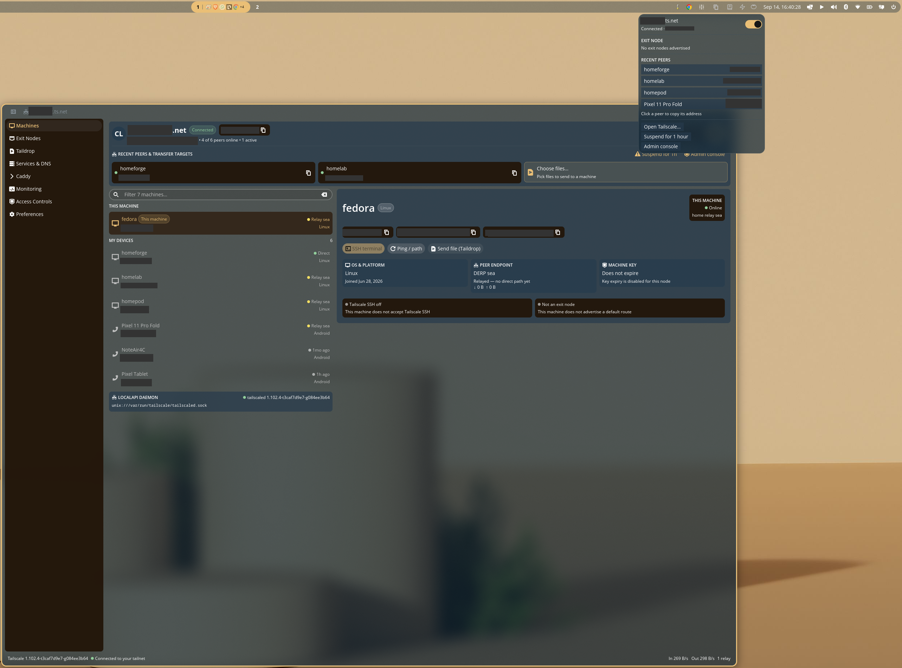
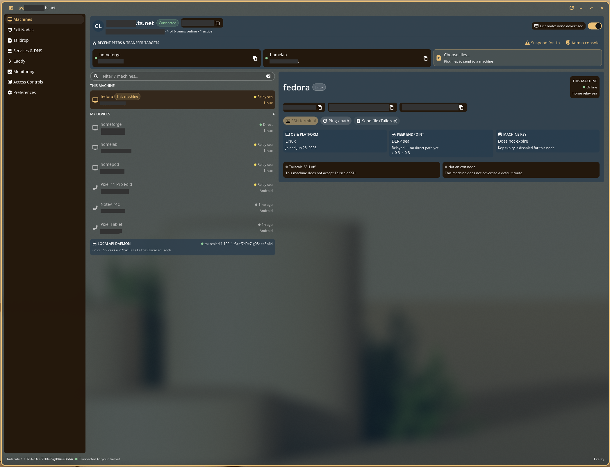
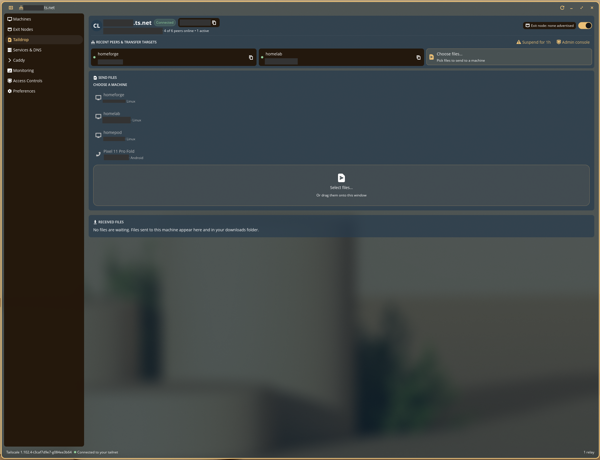
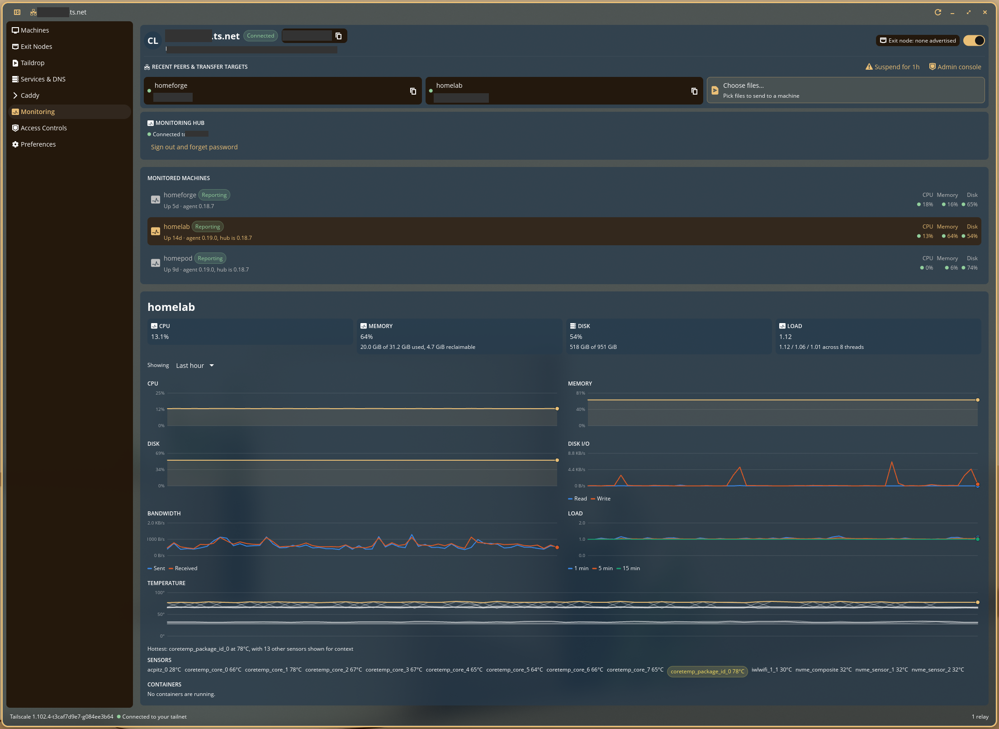

# cosmic-tailscale

A native Tailscale client for the [COSMIC](https://system76.com/cosmic) desktop,
built with `libcosmic`. It talks to the local `tailscaled` daemon directly over
its UNIX socket, so it reflects the real state of your tailnet without shelling
out to the `tailscale` binary or parsing its human-readable output.

Two front-ends share one backend:

- **`cosmic-applet-tailscale`** — a panel applet for the things you do in
  passing: toggle the tunnel, switch exit node, copy a peer's address.
- **`cosmic-tailscale`** — a window for everything else: machines, exit nodes,
  Taildrop, published services, a Caddy manager and Beszel hardware monitoring
  for tailnet peers, and access control.

Both inherit the desktop's theme, accent colour, typography, and density with no
configuration of their own.



<sub>Tailnet names and addresses are masked in every screenshot.</sub>

## Repository layout

```
crates/
  tailscale-localapi/        the daemon client — no GUI dependencies
    src/
      transport.rs           HTTP/1.1 over the tailscaled UNIX socket
      client.rs              typed calls and the IPN event stream
      model/                 status, prefs, serve, taildrop, ping, ipn
  caddy-admin/               Caddy's JSON admin API, reached across a tailnet
    src/
      client.rs              config reads and structural route edits
      discovery.rs           probe a peer for a reachable admin API
      tunnel.rs              port-forward over Tailscale SSH
  beszel-client/             a Beszel monitoring hub's PocketBase API
    src/
      client.rs              auth, systems, stats, containers
      deploy.rs              agent installation over Tailscale SSH
      model/                 system, stats, container records
  cosmic-tailscale/          the main window
    src/
      app/                   state, messages, async tasks, subscriptions
      pages/                 one module per sidebar destination
      ui/                    formatting, icon names, shared widgets
  cosmic-applet-tailscale/   the panel applet
    src/applet/              popup, panel icon states, activation tokens
  http-stub/                 test-only HTTP server that records raw requests
data/                        desktop entries, icons, AppStream metadata
scripts/                     install, packaging, coverage, and their tests
docs/                        the brief, design notes, mockups, screenshots
.github/                     CI, release and Dependabot configuration
```

The dependency direction is strictly one way: `tailscale-localapi`,
`caddy-admin` and `beszel-client` know nothing about `libcosmic`, which keeps
them testable without a compositor and usable from anything else.

## Requirements

- Tailscale — `just tailscale` installs and configures it if needed
- Rust 1.93 or newer, and [`just`](https://github.com/casey/just)
- A C compiler, `pkg-config`, `cmake`, and the `libxkbcommon` development
  package (`libxkbcommon-devel` on Fedora, `libxkbcommon-dev` on Debian and
  Ubuntu)
- A COSMIC session to run it in

That list is complete: it is what a bare `ubuntu:24.04` container needed to
build the workspace. Everything else, Wayland included, is loaded at runtime.

## Install

Each channel starts working once it has been set up; see
[Distribution channels](#distribution-channels) for what is live. Until then,
the [release tarball](#from-a-release) installs the same files.

Packages install the app, the panel applet and the "Send via Taildrop…" action.
None of them installs Tailscale itself, which comes from
[Tailscale's own repositories](https://tailscale.com/download/linux) so that the
daemon keeps receiving its security updates. `install-tailscale.sh` in this
repository (or `just tailscale`) sets it up, including the operator step
described under [Build and install](#build-and-install).

### Pop!_OS, Ubuntu and Debian

For Pop!_OS 24.04, Ubuntu 24.04 or later, and Debian 13 or later, on x86_64:

```sh
sudo curl -fsSLo /usr/share/keyrings/cosmic-tailscale-archive-keyring.gpg \
  https://leechristophermurray.github.io/tailscale-cosmic-client/cosmic-tailscale-archive-keyring.gpg
sudo curl -fsSLo /etc/apt/sources.list.d/cosmic-tailscale.sources \
  https://leechristophermurray.github.io/tailscale-cosmic-client/cosmic-tailscale.sources
sudo apt update
sudo apt install cosmic-tailscale
```

### Fedora

```sh
sudo dnf copr enable iamthinkking/cosmic-tailscale
sudo dnf install cosmic-tailscale
```

### Arch Linux

From the AUR, built from source or prebuilt:

```sh
paru -S cosmic-tailscale      # or: paru -S cosmic-tailscale-bin
```

### After installing

Add the applet in **Settings ▸ Desktop ▸ Panel ▸ Configure panel applets**.

Builds from before the app ID changed used `com.system76.CosmicTailscale`. The window
carries their settings and saved Beszel password over on its first launch, and
installing removes the old desktop entries, but the panel still lists the applet
under its old ID: remove it there and add it again.

## Build and install

On a new machine, one command sets up Tailscale and installs the app:

```sh
just setup
```

`just setup` runs `just tailscale` and then `just install-user`. The Tailscale
step is safe to repeat — on a machine that is already set up it changes nothing
and never asks for `sudo`. It:

1. installs Tailscale if it is missing, from Tailscale's own package
   repositories using their official installer (downloaded to a file and run
   from there, never piped into a shell);
2. enables and starts `tailscaled`;
3. makes you the daemon's **operator**.

The third step is the one that is easy to miss. `tailscaled` accepts changes only
from root or its operator. Without it the app still shows your tailnet, but every
switch — connect, exit node, SSH, DNS — is refused. `install` and `install-user`
print a note if any of these is not in place.

It does not run `tailscale up`: signing in opens a browser, and the app's own
Sign in button does that. Preview the privileged steps with
`DRY_RUN=1 just tailscale`.

Tailscale is deliberately not bundled. `tailscaled` is a privileged system
daemon that needs its own security updates, which Tailscale's repositories
deliver; a copy vendored into this project would quietly stop receiving them. A
distribution package of this app should declare Tailscale as a dependency
instead.

Individually:

```sh
just                 # release build
just test            # run the test suite
just check           # clippy, warnings denied

just install-user    # build and install into ~/.local — no root

just build-release   # ...or system-wide, in two steps
sudo just install
```

Both recipes install the same set: the two binaries, all three desktop entries
(the window, the applet, and the "Send via Taildrop…" file-manager action), the
AppStream metadata, and the icons. Both — along with `uninstall`,
`uninstall-user` and the release tarball — go through one script,
`scripts/install.sh`, so they cannot drift apart. For a distribution package,
stage into a directory with `just rootdir=/path/to/stage install`; a staged tree
gets no `mimeinfo.cache` or icon cache, since the package manager's triggers
build those on the target system.

The system-wide `install` deliberately does not build. Running `sudo just install`
on a recipe that compiled first would run `cargo` as root and leave root-owned
artifacts in `target/`, breaking every later build as your own user.

Installing puts the applet on the system, but does not place it on your panel —
add it in **Settings ▸ Desktop ▸ Panel ▸ Configure panel applets**.

To iterate on the applet, `just dev-install` symlinks the binaries into
`~/.local/bin`; after that `just dev-reload` rebuilds and restarts the panel so
it picks up the new binary.

To run the applet outside the panel, use `just run-applet` rather than invoking
the binary directly. `cosmic-panel` sets `X_PRIVILEGED_WAYLAND_SOCKET` and hands
the matching file descriptor to the applets it launches; a terminal in a COSMIC
session inherits the variable but not the descriptor, and libcosmic's
activation-token thread panics trying to adopt the stale fd. The recipe clears
the variable so the applet connects to Wayland normally.

### From a release

Tagged releases on GitHub carry a tarball built by CI, with a `.sha256` beside
it. It needs no Rust toolchain:

```sh
sha256sum -c cosmic-tailscale-*-x86_64-linux.tar.gz.sha256
tar -xzf cosmic-tailscale-*-x86_64-linux.tar.gz
cd cosmic-tailscale-*-x86_64-linux
./install-tailscale.sh   # if Tailscale is not set up yet
./install.sh             # into ~/.local; or: sudo ./install.sh --prefix /usr
```

`just package` builds the same tarball locally, into `dist/`.

### Poking at it

To see what the daemon reports without starting a GUI:

```sh
just status
```

To reproduce the Caddy connection flow against a peer, without the GUI:

```sh
cargo run -p caddy-admin --example connect -- homeforge
```

## What it does

### The panel applet

The applet's icon shows the connection state at a glance; its popup, at the top
right of the screenshot above, holds what you reach for in passing:

- the tunnel switch, with the tailnet name and this machine's address;
- the exit node picker, or a note that no peer advertises one;
- recent peers, each copied to the clipboard with a click;
- with a Beszel hub configured, a monitoring summary that names any unhealthy
  machine and lists each one's CPU and memory; **pin** one to show its busier
  figure beside the panel icon, and desktop notifications when a hub alert
  fires or clears;
- **Open Tailscale…**, **Suspend for 1 hour** and **Admin console**.

Suspending turns the tunnel off and back on after an hour, unless you reconnect
first.

### The window

Every page shares one header: the tailnet name and connection state, this
machine's address, peer counts, the exit node in use, and the tunnel switch.
Beneath it, **Recent peers & transfer targets** keeps your most-used machines
one click away, beside a **Choose files…** shortcut for Taildrop. A status bar
along the bottom shows the `tailscaled` version, live throughput, and how many
DERP relays are in use.

### Machines



A filterable list of every node, split into this machine, your devices, and
machines shared with you. Each row shows how the peer is actually reached —
a direct WireGuard path or a DERP relay — rather than just "online". Below the
list, the LocalAPI card names the socket and daemon version the app is
talking to.

The detail pane has copyable IPv4, IPv6, and MagicDNS addresses, a latency probe
that reports the real path, **Send file (Taildrop)**, and one-click **SSH
terminal**, which opens `tailscale ssh` in `cosmic-term`. Authentication comes
from your tailnet identity, so there are no keys to distribute. Status cards
cover the platform, the peer endpoint, key expiry, and whether the machine
accepts Tailscale SSH or offers itself as an exit node.

#### Files

**Mount** makes another machine's home directory a location in COSMIC Files,
through GVfs — the same `gio mount sftp://user@host/` that Files' own
**Connect to server** uses, so the mount is visible to every GIO application and
stays until it is unmounted. Enter the SSH user once; it is remembered per
machine and defaults to your local user name. Once mounted, **Open in Files**
opens the remote home directory and **Unmount** ends the mount. A machine
mounted from Files instead is recognised too, by its MagicDNS name or address.

Some details:

- GVfs runs `ssh` non-interactively, so it can neither accept a new host key nor
  ask for a password. Mounting therefore starts with a short `ssh` login that
  records the host key (the WireGuard link has already authenticated the node)
  and reports a refused login in plain words before GVfs is involved. The login
  itself needs an SSH key or Tailscale SSH; password-only servers are not
  supported.
- The home directory is whatever the SFTP server reports, which GVfs records as
  the mount's default location, rather than an assumed `/home/<user>`.
- Machines are mounted by MagicDNS name when this machine uses MagicDNS, and by
  Tailscale IPv4 address otherwise. Phones and tablets are not offered a mount.
- Needs `gio` (from glib), GVfs's SFTP backend, and an SSH client — installed
  with COSMIC on most systems, and recommended by every package.

### Exit nodes

Pick a peer to carry your internet traffic, or advertise this machine as an exit
node. When a tailnet admin has not yet approved an advertised route, the page
says so — advertising alone does not make a machine usable.

### Taildrop



Sending and receiving files, in both directions, on one page. Choose a machine
from those that can receive, then **Select files…** to open the desktop's own
file chooser; the transfer starts as soon as you pick. Files can also be dropped
onto the window (see [Desktop integration](#desktop-integration) for how
dependable that is). Files are queued if you pick them before a machine, and
sent when you choose one. Files sent to this machine wait under **Received
files** until **Save all to Downloads**.

### Services & DNS

MagicDNS state and what this machine publishes with `tailscale serve` (tailnet
only) or `tailscale funnel` (the public internet). Funnelled services are marked
distinctly, because the difference is who can reach them.

### Caddy

Manage a Caddy reverse proxy running on any tailnet peer. Caddy is configured
through its JSON admin API, so routes are edited structurally and applied live —
no Caddyfile to parse and no service restart.

The admin API normally binds to the peer's own localhost. The page tries the
peer's tailnet address first, and falls back to forwarding the port over
Tailscale SSH, so the admin port is never exposed to the network. A hostname
ending in `.ts.net` gets its HTTPS certificate from Tailscale automatically.

Two details are worth knowing, because both produce confusing failures:

- Caddy validates the `Host` header of every admin request against its
  configured origins. Through a tunnel the port we dial is one Caddy has never
  heard of, so requests claim the loopback origin it allows by default — and are
  sent in origin-form, because Go's HTTP server takes `r.Host` from the URL
  authority of an absolute-form request line and ignores the header entirely.
- A Caddyfile compiles to nested `subroute` handlers, so the raw route list is
  one entry containing every upstream on the machine. The page walks the tree to
  the leaves to recover the `host -> upstream` pairs that were actually
  configured. Only routes this client created carry an `@id`, so only those can
  be removed; the rest are labelled as coming from the Caddyfile.

### Monitoring

Hardware health from a [Beszel](https://beszel.dev) hub on your tailnet, beside
the machines it belongs to: CPU, memory, disk, load, sensors, ZFS pools and
per-container stats. The hub never needs to be on the public internet.



Pick a monitored machine to see its summary cards and history. Memory is split
into used and reclaimable, load is set against the thread count, and the sensors
row highlights the hottest reading. Double-click the **Disk** card, or the Disk
or Disk I/O chart title, to open that machine in COSMIC Files — mounting it
first, as described under [Files](#files), if it is not mounted already.

**Alert notifications.** Alerts set in the hub's web interface — CPU, memory,
disk, temperature, load, bandwidth, GPU, battery, or a machine going down —
arrive as desktop notifications when they fire and when they clear, with a
machine going down marked urgent. A switch on this page turns them off.

- They are sent by the panel applet, which runs for the whole session, rather
  than by this window, which may be closed; so the applet has to be on the
  panel.
- The applet reads the hub's alert history each minute. Alerts already firing
  when it starts are not announced, and more than three changes at once arrive
  as one notification.
- The hub records each alert's threshold, not the reading that crossed it, nor
  which disk or sensor did, so a notification says "Disk usage is above 80%"
  rather than naming a figure it does not have.
- Needs Beszel 0.12 or later, which introduced the alert history.

Beszel's records use very short keys — memory percent is `mp`, temperatures are
`t` — because they are written per machine per interval and kept for months. Two
things are worth knowing about how they are read:

- **`mu` is already the committed figure.** The agent subtracts buffers, cache
  and the ZFS ARC from it and reports each separately. Treating them as
  components of `mu` and subtracting again makes a machine using 4.7 GiB report
  zero. `memory_reclaimable()` reports them alongside, never inside.
- **Load average is shown against the thread count.** `0.8` is idle on sixteen
  threads and saturated on one. Where the thread count is unknown, no figure is
  given rather than a misleading one.

Each machine gets time-series charts — CPU, memory, disk, disk I/O, bandwidth,
load and temperature — over a selectable window, with one period control above
all of them rather than one per card. They are drawn natively on an `iced`
canvas, so they inherit the desktop theme like everything else.

Three things about how they are coloured, since none of it is arbitrary:

- **Single-series charts use the desktop accent.** One mark means no pairs to
  keep apart, and an accent is guaranteed legible on its own surface.
- **Multi-series charts do not.** A user's accent is arbitrary — this machine's
  light accent is a dark desaturated teal, below both the lightness band and the
  chroma floor a categorical slot must clear. Fine alone, unfit beside two
  siblings. Those charts use a fixed blue/orange/aqua palette instead, validated
  all-pairs against COSMIC's real surfaces in both modes (worst CVD ΔE 9.2 light
  / 9.4 dark against a target of 8). A series therefore keeps its colour when the
  theme changes.
- **Temperature uses emphasis, not eight colours.** A machine reporting eight
  sensors would need eight hues that no one could tell apart; instead the hottest
  is drawn in the accent and the rest recede to context, with the peak named in
  the caption.

Axes keep a zero baseline but scale their ceiling to the data. Truncating the
baseline is what makes a molehill look like a mountain; refusing to scale the
ceiling is what draws a machine sitting at 18% as a flat line six pixels tall.

Machines the hub is not monitoring are listed separately, and can have the agent
installed over Tailscale SSH. That runs a vendor script as root, so the exact
command is shown, on the named host, and nothing runs until you approve that
specific one — there is deliberately no way to approve a batch.

Credentials: the hub address and account go in `cosmic-config`; the password
goes to the system keyring via the freedesktop secret service. The session token
is reused between refreshes, so a background poll sends no password.

### Access controls

Node key expiry with a countdown, Tailscale SSH, shields-up, and the subnet
routes this machine advertises. When a tailnet has key expiry disabled, the page
says that rather than inventing a countdown.

### Preferences

Whether to accept subnet routes and use the tailnet's DNS; the signed-in account,
with **Sign in** or **Reauthenticate**; and the daemon's own health, including
any warnings it reports.

## Desktop integration

- **Taildrop** — the [Taildrop page](#taildrop)'s drop zone opens the desktop's
  own file chooser through the XDG portal, and the **Send file** button on a
  machine does the same and starts the transfer as soon as you pick. This is the
  dependable path.
- **Dragging** — the window is also a drop target, accepting both `text/uri-list`
  and the portal's file-transfer handover. This is best-effort: winit's
  `FileDropped` event never fires on Wayland, so the drop goes through
  libcosmic's `dnd_destination` instead, and whether it arrives depends on what
  the sending application offers.
- **File manager** — "Send via Taildrop…" registers as a handler for a broad
  list of file types, so it appears under *Open With*, and hands the selection
  to the window to pick a machine. There is no cross-desktop MIME type meaning
  "any file" (`all/all` is a KDE convention that `update-desktop-database`
  discards, registering nothing), so the list in the desktop entry is
  explicit.
- **Notifications** — an arriving Taildrop transfer offers **Save to
  Downloads**, which fetches the file from the daemon and only then clears it
  from the queue, so a failed write cannot lose the transfer. A node key within
  a week of expiry warns with a **Reauthenticate** action.
- **Terminal** — **SSH terminal** opens a `cosmic-term` tab running
  `tailscale ssh`.
- **Panel** — the applet icon has a distinct silhouette per state (off,
  connecting, connected, exit node) rather than a distinct colour, because the
  panel renders symbolic icons in a single tint.

## How it stays in sync

`tailscaled` pushes state changes over its IPN bus, so the UI is event-driven
rather than poll-driven: flipping the switch in `tailscale up` updates the window
immediately. The bus does not carry the peer map, so a slow timer re-reads that
alongside it — and it is what notices the daemon came back after a restart. The
bus subscription reconnects on its own.

Every write goes through the daemon and the UI reconciles against what comes
back, rather than assuming the write succeeded.

## Localization

Both binaries use Fluent catalogues, embedded at build time:

```
crates/cosmic-tailscale/i18n/en/cosmic-tailscale.ftl
crates/cosmic-applet-tailscale/i18n/en/cosmic-applet-tailscale.ftl
```

Add a language by copying the `en` directory to its language code and
translating the values. Nothing needs registering — the catalogue directory is
embedded, and the desktop's language preference selects from it at startup.

## Testing

```sh
just test        # Rust tests, installer scenarios, packaging checks
just coverage    # line coverage of product code (--html for a report)
```

`just test` runs four layers:

- **Rust tests** — decoding against a redacted capture of real daemon output;
  the update loop driven message by message; every page rendered headlessly;
  and each service client talking to `http-stub`, a stand-in server that records
  requests exactly as sent. That last layer is what catches wire-level bugs — an
  absolute-form request line, a notify mask one bit off — that no function-level
  mock can see.
- **`scripts/test-install-tailscale.sh`** — the installer run against simulated
  machines, with fake `tailscale`, `systemctl`, `curl` and `sudo`. It installs
  nothing and downloads nothing, so it behaves the same on any machine.
- **`scripts/test-install.sh`** — `install.sh` and `package.sh` in a throwaway
  `HOME` with stand-in binaries: the per-user, staged and tarball installs place
  exactly the expected files, uninstall removes them, and two builds of the
  tarball are byte-identical.
- **`scripts/check-packaging.sh`** — shellcheck, `desktop-file-validate` and
  `appstreamcli`, each reported as skipped rather than passed when the tool is
  not installed (`STRICT=1` fails instead, as CI does).

`just coverage` needs `cargo-llvm-cov` and LLVM tools matching rustc's LLVM
(`rustup component add llvm-tools-preview`, or a system `llvm-cov` of the same
major version, which it finds itself). It counts product code only: tests live
in trailing `#[cfg(test)]` modules, which always execute and would otherwise
report themselves as covered, so the script drops them, along with `tests/`,
`examples/` and the test-support crate.

Tests that spawn a fake `ssh` hold a shared lock while writing the script and
spawning it. Without it, a parallel test forking mid-write inherits the open
file, and the kernel refuses to execute it (`ETXTBSY`) — which failed these
tests about a third of the time.

Still untested: `view` code outside the pages, chart drawing (canvas `draw`
only runs with a renderer), subscriptions, the keyring, and notifications.
Mounting is tested against stand-in `gio` and `ssh` scripts, whose output
follows glib's `gio mount` source, and alert tracking against Beszel's schema;
neither has been run against a real SSH server or hub alert.
Wayland drag-and-drop and the applet inside a real `cosmic-panel` can only be
checked by hand.

## Continuous integration

`.github/workflows/ci.yml` runs on every push to `main` and every pull request:

| Job | What it runs |
| --- | --- |
| Format | `cargo fmt --check` |
| Clippy | `cargo clippy --workspace --all-targets -- -D warnings` |
| Test | `cargo test --workspace` |
| Scripts and packaging | both script test suites, then `check-packaging.sh` with `STRICT=1`, in a Fedora container (see below) |
| Minimum Rust version | `cargo check` on the `rust-version` from `Cargo.toml` |
| Coverage | `scripts/coverage.sh`; the table goes to the run summary, `lcov.info` to an artifact |
| Package | release build and tarball, uploaded as an artifact (not on pull requests) |

Every Cargo step uses `--locked`, so a `Cargo.lock` that is out of date fails
rather than being silently rewritten. The runner needs only `libxkbcommon-dev`
(the one library the binaries link) and `cmake` (for `aws-lc-sys`) beyond the
usual build tools — a list found by building the workspace in a bare
`ubuntu:24.04` container rather than copied from another project. The shared
setup lives in `.github/actions/setup`.

The scripts job runs in a `fedora:44` container for one reason: COSMIC's
desktop entries use `Categories=COSMIC`, which desktop-file-utils registered in
0.28, and Ubuntu 24.04 still ships 0.27. The container runs as root, and the
installer suite, whose scenarios are all a desktop user running the installer,
re-runs itself as `nobody` there.

Third-party actions are pinned to full commit SHAs, with the version in a
comment; Dependabot proposes updates to them, and to crates, weekly. `libcosmic`
is excluded — it is pinned to a git revision, and moving it is a change to test
deliberately. The Rust cache is written only from `main`, so pull requests read
it but cannot alter what `main` builds from.

### Releasing

1. Set the new version in each place that records it, and commit:
   - `version` under `[workspace.package]` in `Cargo.toml`
   - `Version:` and a new `%changelog` entry in `packaging/rpm/cosmic-tailscale.spec`
   - `pkgver=` in both `packaging/arch/*/PKGBUILD`
   - a new `<release>` in the metainfo

   `scripts/check-versions.sh` confirms they agree; CI runs it on every push.
2. Tag it and push the tag:

   ```sh
   git tag -s v0.2.0 -m v0.2.0
   git push origin v0.2.0
   ```

`.github/workflows/release.yml` then:

1. checks that the tag matches every recorded version;
2. runs the whole of CI against the tagged commit;
3. publishes a GitHub release with the tarball, the `.deb`, their checksums and
   generated notes;
4. publishes to each distribution channel below that has been set up.

A tag with a suffix, such as `v0.2.0-rc.1`, becomes a pre-release, and is left out
of the apt repository. The publish job is the only one with write access to the
repository, and it builds nothing: it ships what CI built and tested in the same
run.

### Distribution channels

Every package installs through `scripts/install.sh`, so each one lays out exactly
the files `scripts/test-install.sh` checks.

| Channel | Compiled by | From |
| --- | --- | --- |
| apt (GitHub Pages) | CI, on Ubuntu 24.04 | the release binaries |
| Fedora COPR | COPR's builders | the tagged source, via `.copr/Makefile` |
| AUR `cosmic-tailscale` | the installing machine | the tagged source |
| AUR `cosmic-tailscale-bin` | CI | the release tarball |

Each channel needs a one-time setup. Until then its release job skips itself with
a notice, rather than failing the release.

**Apt repository.**

1. In **Settings ▸ Pages**, set the source to **GitHub Actions**.
2. In **Settings ▸ Environments ▸ github-pages**, add a deployment tag rule for
   `v*`. By default only `main` may deploy, and releases run from tags.
3. Create a signing key on a machine you trust, and keep a backup of it offline:

   ```sh
   gpg --batch --passphrase "" \
     --quick-gen-key "cosmic-tailscale apt signing <you@example.com>" ed25519 sign 3y
   gpg --armor --export-secret-keys "cosmic-tailscale apt signing"
   ```

4. Store the exported private key as the repository secret `APT_SIGNING_KEY`. A
   key with a passphrase works too; put the passphrase in
   `APT_SIGNING_PASSPHRASE`. Since the secret already holds the key itself, a
   passphrase beside it protects little — what matters is that this key signs
   nothing else.

The workflow publishes the matching public key beside the repository. Before the
key expires, extend it and update the secret. Users have to fetch the keyring
file again to see the new expiry date, so announce it in the release notes.

**Fedora COPR.**

1. Sign in to <https://copr.fedorainfracloud.org> with a Fedora account.
2. Create the project with network access enabled. The build fetches crates and
   libcosmic from the network:

   ```sh
   copr-cli create cosmic-tailscale --enable-net on \
     --chroot fedora-43-x86_64 --chroot fedora-44-x86_64 \
     --chroot fedora-45-x86_64 --chroot fedora-rawhide-x86_64
   ```

   `copr-cli list-chroots` shows what is currently offered.
3. Copy the API token from <https://copr.fedorainfracloud.org/api/> (the contents
   of `~/.config/copr`) into the secret `COPR_CONFIG`. COPR tokens expire, so
   this needs replacing roughly twice a year.
4. Set the repository variable `COPR_PROJECT` to `<fedora-account>/cosmic-tailscale`.

The account here is `iamthinkking`, so `COPR_PROJECT` is
`iamthinkking/cosmic-tailscale` — no trailing slash, which copr-cli reads as an
empty project name.

**AUR.**

AUR account registration is closed to new accounts at the moment, so this
channel is waiting on that. The names `cosmic-tailscale` and
`cosmic-tailscale-bin` are both unclaimed.

1. Create an account at <https://aur.archlinux.org>.
2. Make a key for publishing only, and add `aur_deploy.pub` to the account:

   ```sh
   ssh-keygen -t ed25519 -f aur_deploy -N "" -C "cosmic-tailscale AUR deploy"
   ```

3. Store the private key `aur_deploy` as the secret `AUR_SSH_PRIVATE_KEY`.

The first release creates both AUR packages. AUR's host keys are pinned in
`packaging/arch/aur_known_hosts`, checked against the fingerprints AUR publishes.

## License

MPL-2.0
